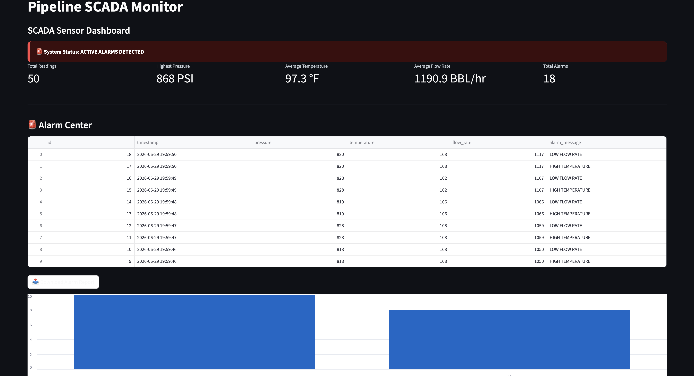

# Pipeline SCADA Monitoring Dashboard

A Python-based SCADA (Supervisory Control and Data Acquisition) monitoring dashboard that simulates real-time pipeline operations, sensor monitoring, alarm management, and operational reporting.

Built with Python, Streamlit, SQLite, Git, and GitHub to demonstrate software development, industrial monitoring concepts, and cybersecurity-related skills.

---

## Project Overview

This application simulates a pipeline SCADA environment by generating sensor readings, monitoring operating conditions, logging alarms, and displaying system data through an interactive dashboard.

The project demonstrates how software can be used to monitor industrial systems while providing operators with real-time visibility into pipeline conditions.

---

## Why I Built This

I built this project to strengthen my software development skills while learning more about Industrial Control Systems (ICS), SCADA environments, and critical infrastructure.

Rather than building a generic Python application, I wanted to create a project based on a real world industry where technology plays a critical role. Industries such as oil and gas, manufacturing, utilities, and energy rely on SCADA systems to monitor equipment, collect operational data, and improve situational awareness.

This project also allowed me to gain hands-on experience with Python, SQL, Git, GitHub, dashboard development, and software documentation while creating a portfolio project that reflects my interest in cybersecurity and critical infrastructure.

---

## Features

- Simulated real time pipeline sensor monitoring
- Pressure, temperature, and flow visualization
- Alarm detection and management
- Historical sensor logging
- Interactive Streamlit dashboard
- SQLite database integration
- CSV export functionality
- Clean and user friendly interface

---

## Technologies Used

- Python
- Streamlit
- SQLite
- SQL
- Git
- GitHub

---

## Project Structure

```text
pipeline-scada-monitor/
│
├── alarms/
├── database/
├── docs/
├── sensors/
├── theme/
├── app.py
├── requirements.txt
└── README.md
```

---

## Dashboard Preview



---

## How to Run the Project

### Clone the repository

```bash
git clone https://github.com/markell2023/pipeline-scada-monitor.git
```

### Navigate to the project directory

```bash
cd pipeline-scada-monitor
```

### Install the required dependencies

```bash
pip install -r requirements.txt
```

### Launch the Streamlit application

```bash
streamlit run app.py
```

### Open the dashboard

If the application does not open automatically, visit:

```
http://localhost:8501
```

---

## Skills Demonstrated

- Python programming
- SQL and SQLite database management
- Streamlit application development
- Git version control
- GitHub repository management
- Data visualization
- Software documentation
- Industrial Control System (ICS) concepts
- SCADA monitoring concepts
- Problem solving

---

## Future Improvements

Potential future enhancements include:

- User authentication
- Role-based access control
- Interactive pipeline map
- Additional sensor types
- Email or SMS alarm notifications
- REST API integration
- Live IoT sensor integration
- Cybersecurity monitoring features
- Enhanced reporting and analytics

---

## Author

**Markell Mitchell**

GitHub: https://github.com/markell2023

---

## License

This repository is intended for portfolio demonstration purposes.
